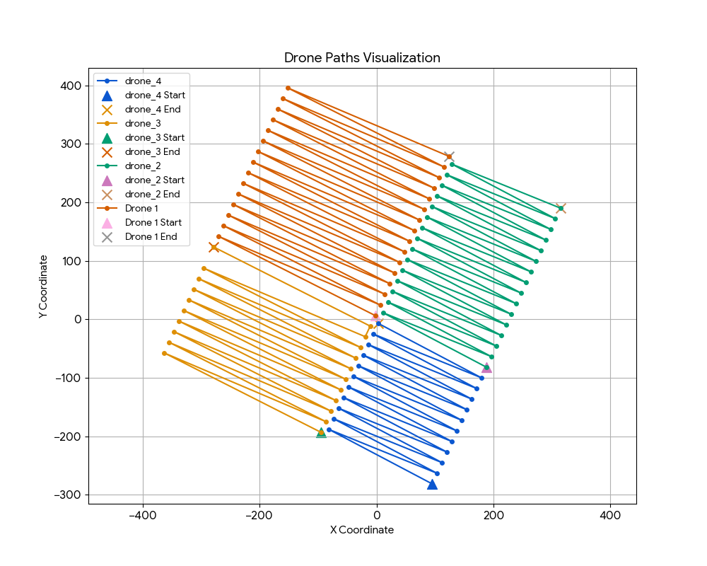
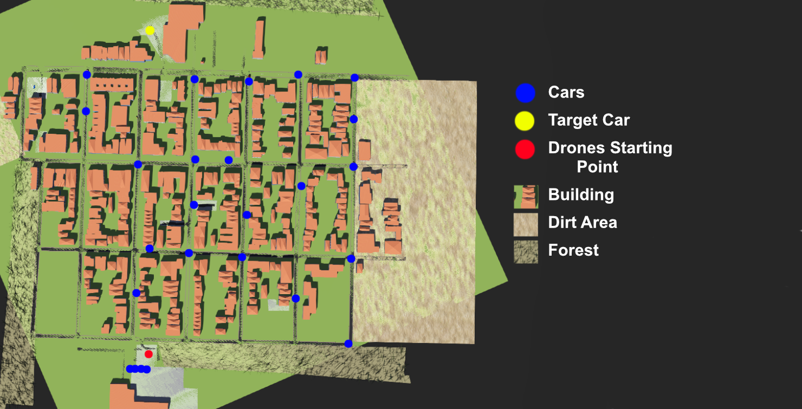

# Webots City Search Drone Swarm with YOLOv8
<video src="timeline 1.webm" width="100%" controls></video>

[Watch the Demo Video](demo.mp4)
## Description
This project simulates a swarm of 4 drones in a Webots city environment performing a coordinated search and rescue mission. The drones use **YOLOv8** for real-time object detection to locate a specific target (a blue car) within the city. Upon detection, the finding drone broadcasts the coordinates to the swarm, and a supervisor controller coordinates the drones to form a formation above the target.





## Features
- **Swarm Intelligence**: 4 distributed drone controllers interacting with a central supervisor.
- **Computer Vision**: Integration of YOLOv8 for real-time object detection from drone camera feeds.
- **Path Planning**: Zig-zag search pattern combined with dynamic re-tasking for formation flight.
- **Simulation**: High-fidelity physics simulation using Webots.
- **Visualization**: Real-time trail drawing in the 3D view to visualize drone paths.

## Prerequisites
- **Webots**: R2023b or later recommended.
- **Python**: 3.8+
- **Libraries**:
  ```bash
  pip install ultralytics numpy
  ```

## Installation
1. Clone this repository:
   ```bash
   git clone https://github.com/newtonhaven/Webots-city-search-DJI-YOLO.git
   ```
   (for SSH)
   ```bash
   git clone git@github.com:newtonhaven/Webots-city-search-DJI-YOLO.git
   ```
2. Ensure you have Webots installed.
3. Install the required Python libraries using pip as shown above.
4. YOLOv8 model (`yolov8_trained.pt`) is trained in roboflow.com. Dataset can be seen in `yolo training data` folder

## Usage
1. Open the world file in Webots:
   `worlds/my_world.wbt`
2. The simulation should auto-compile the controllers. If not, you may need to manually compile them or ensure your Python path is correctly set in Webots preferences.
3. Run the simulation.
   - The drones will take off and begin their search pattern.
   - The supervisor will monitor communications.
   - Open the "Console" in Webots to see logs from the drones and supervisor.

## Project Structure
```
my_project/
├── controllers/
│   ├── city_search_drone/
│   │   ├── city_search_drone.py   # Main drone logic (Flight, YOLO, Comms)
│   │   └── yolov8_trained.pt      # YOLO model (ensure this exists)
│   └── supervisor/
│       └── supervisor.py          # Central supervisor (Comms, Trail drawing)
├── worlds/
│   └── my_world.wbt               # Webots world file
├── README.md
└── ...
```

## detailed Logic
- **Search Phase**: Drones fly a pre-calculated zig-zag pattern over their assigned quadrants.
- **Detection**: Each drone runs YOLOv8 on its camera feed. If a car is "seen" and matches the specific color filter (blue), it is confirmed as the target.
- **Communication**: The finding drone emits a "FOUND" signal with coordinates.
- **Formation**: The Supervisor receives the signal and commands all drones to converge at the target location in a formation.

## License
This project is licensed under the MIT License - see the [LICENSE](LICENSE) file for details.
